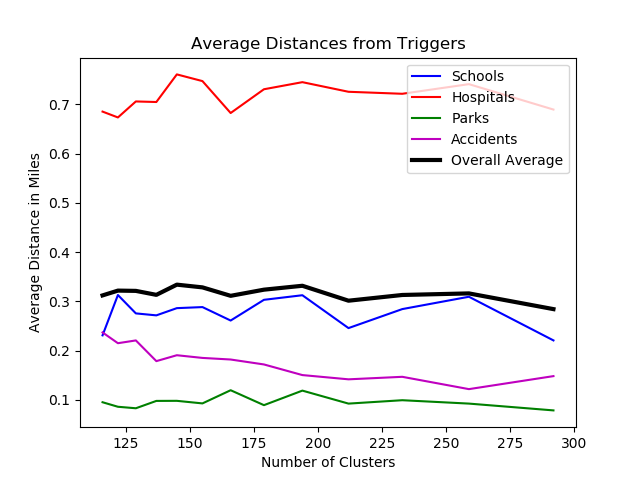

# **Important Note**
This set of scripts is no longer designed to be run via execute in the parent directory. To enable this functionality, one would need to remove the logic.py and server.py files. Instead, we modified execute and made it functional in logic.py so that our web server, server.py, can run our entire algorithm with variable inputs.

# Optimal Placement of Speed Feedback Signs in the City of Boston
 
*source: City of Boston*

## The Problem
#### Introduction and Motivation
Our team set out to determine an optimal placement of Speed Feedback Signs in the City of Boston. To do this, we analyzed where accident hotspots were around the city (further referred to as clusters), and where vulnerable areas are. Despite a plethora of types of potentially vulnerable areas, we decided to focus on schools, hospitals, and open spaces, such as parks. We used these locations collectively as 'triggers', or sites of equal weight in our scoring algorithm. We also clustered accidents to get locations where accidents frequently occur, and used these locations as another trigger of equal weight. We hope to solve this problem by placing signs so that the average distance between each sign and its nearby triggers is minimized, in order to protect vulnerable areas. We also have a constraint that each sign must be at least half a mile apart, so our signs don't clump in one area. This problem was previously hosted as an [open data challenge](https://docs.google.com/document/d/11QtIfhwWJEDumRgzKkkH68bzh9qrra15vVwvuNsz_oY/mobilebasi), but we sought to give it an additional look. 
#### Explanation of Process
We categorized our approach into two parts.  
**Part 1** - Placement of Speed Feedback Signs
* Phase 1: 
Cluster accidents into accident hot spots via k-means, where the number of means is proportional to the number of input nodes.  
To look at signal placement results, open placements.html within the same directory.
* Phase 2:  
Filter intersections by proximity to accident clusters. For an intersection to be a candidate placement site, the intersection must be in the lower 50th percentile with regards to distance to closest accident cluster. This ensures that final placements are not skewed by proximity to vulnerable sights alone, but must also be close to where accidents are known to occur. 
* Phase 3: 
We consider school, hospital, and open space locations, as well as accident cluster locations, as equally weighted 'triggers', or data points. We then run k-means on this data set, with k = 30 (hard-coded, imagining 30 of these signs are available). We then find the candidate intersection closest to each of these determined means (output of k-means), and output these 30 intersections as the sites of the speed feedback sign placements.
 

**Part 2** - Statistical Analysis
In order to ensure that the placement of speed feedback signs would not be affected by any other variables that can be changed, namely, the number of clusters that is chosen to create the accident hotspots (from Phase 1 of Part 1), we must determine a reasonable number of clusters, *a*, that gives the most optimal placement of s signs. 

* Phase 1: 
For values from *B* = {200 to 80 in multiples of 10}, run all of Part 1 for each value of the "cluster_divisor" variable, *c*, in get_accident_clusters being a value within the set *B* (i.e., c will be 200, then 190, etc.). As you run these parts, get_avgs will store the average distances of each sign placed to schools, parks, hospitals, and accident clusters nearby for each value of *c*.
* Phase 2: 
For each value of *c*, find the average of the averages of all the triggers.
* Phase 3: 
An optimal value for *a* is one that helps in minimizing the distance of a sign to other triggers, so the best value of a would be the number of accidents divided by *c*, which will be the number of clusters that minimizes the average overall distances of all trigger distances.
 

#### Technical Details
* Each unique portion of our process is its own extension of the dml library's algorithm class, and intermediate data is stored using MongoDB.
* --trial flag decreases radius of possible intersections for placement

## Statistical Findings
There were 23,200 total accidents in our accident dataset. According to the graph shown below, the value of *a* is one that minimizes the average overall distance, which is *a* = 212, or *c* = 110. The average distances of signs to other triggers is also shown on the graph to show the overall average's relation to the triggers: the average hospital distances increases the average slightly, but the similarities of the other three triggers allow the overall average to be an accurate measure of the overall distances of the signs. As a result, 212 clusters to cluster accident hotspots ends up being an optimal value of *a*.

 

## Datasets in Use
* Motor Vehicle Accidents (Analyze Boston)
* Hospital Locations (Analyze Boston)
* Street Intersections (Boston Open Data - opendata.arcgis.com)
* Open Spaces (Boston Open Data - opendata.arcgis.com)
* Schools (boston.opendatasoft.com)

## Scripts
* *fetch_accidents.py* 
* *fetch_hospitals.py*
* $$ *fetch_nodes.py*
* *fetch_open_space.py*
* *fetch_schools.py*
  
* $$ *get_accident_clusters.py* - Performs k-means on the input accidents to reduce accidents into accident clusters, which are later used as points of influence as to where feedback signs should be placed.
* $$ *get_signal_placements.py* - Consumes the triggers produced by clean_triggers (below) to determine the optimal placement of speed 
* *get_speed_stats.py*
* *get_avgs.py* - Gets average distances between signs and each trigger
* *get_avg_distance.py* - Finds the optimal number of accident clusters and graphs all the average distances for each trigger
  
* *clean_triggers.py* - Collects and cleans accident clusters, schools, open spaces, hospitals, candidate intersections for placement for use as points in the k-means clustering done in get_signal_placements.
  
* *make_graph.py* - Plots the determined locations for speed feedback sign placements.

$$ - denotes a script with variable parameters for experimental outputs
## Notes
* No authentication necessary for accessing datasets or executing transformations.
* The resource libspacialindex is required to run this set of scripts. On macOS, it can be installed with Homebrew: brew install spatialindex. 

### Python modules in use not typically included in standard Python distributions 
* dml
* geojson
* geoql
* numpy
* pandas
* prov
* scipy
* sklearn 
 
To easily get the environment used, run the following command with the provided environment.yml file (make sure in team folder):  
conda env create -f environment.yml

### Team Members:
* Adriana D'Souza .......... adsouza@bu.edu
* Brian Roach ................. bmroach@bu.edu
* Jessica McAloon ......... mcaloonj@bu.edu
* Monica Chiu ................ mcsmocha@bu.edu
